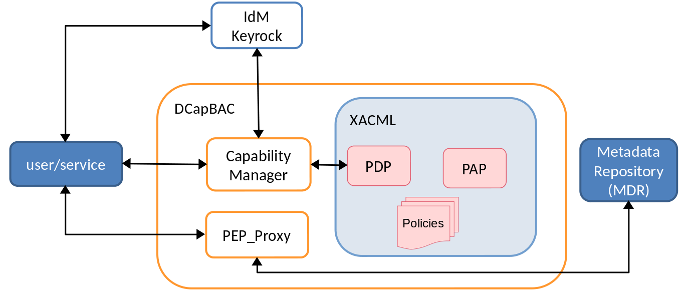
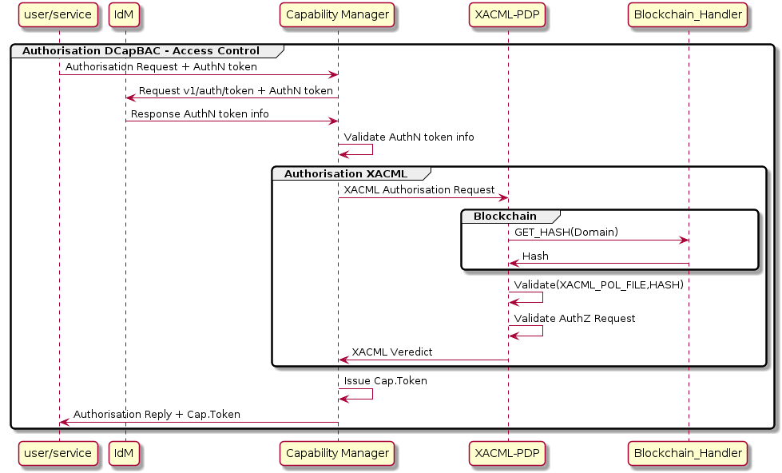

# License

Capability Manager documentation files are made avaialable under the Apache License, Version 2.0 (Apache-2.0), located into the LICENSE file.

# Introduction

## What's Capability Manager

This component is the contact point for services and users that intend to access the resources stored in our IoTCrawler platform. It provides a REST API for receiving authorisation queries. 

Capability Manager is developed in Python and makes use of the functionality developed in Java (.jar file), and it's a DCapBAC component as we can show in the next image:



Remembering DCapBAC technology, where access control process is decoupled in two phases:
- 1st operation to receive authorisation. A token is issued
- 2nd operation access to the resource using the token.

Capability Manager covers the first one.

# IotCrawler integration/functionality

As mentioned above, this component provides a REST API for receiving authorisation queries, which are tailored and forwarded to the XACML PDP for a verdict. 

When an authorisation request is received by Capability Manager, it recovers from the JSON body:
- an authentication token which proceeds from authentication phase (access to IdM-Keyrock).   
- an endpoint of the resource’s request (protocol+IP+PORT). In DCapBAC scenario, it corresponds with PEP-Proxy component.
- the action/method of the resource’s request (“POST”, “GET”,  “PATCH”...)
- the path of the resource’s request

With this information, Capability Manager:
- Access to authentication component (IdM-Keyrock) to validate authentication token.
- Access to XACML framework for validating authorisation requests (through PDP) and obtain if the subject can access to a resource and can perform the action over the resource (verdict). In IoTCrawler project, PDP also access to Blockchain to obtain the hash of the domain and compare with the hash of XAML policies and if not equal verdict is negative, this additional validation doesn't affects to Capability Manager.
- If a positive verdict is received, finally,  the Capability Manager issues an authorisation token called Capability Token which is a signed JSON document which contains all the required information for the authorisation, such as the resource to be accessed, the action to be performed, and also a time interval during the Capability Token is valid. This token will be required to access to the resource (through PEP-Proxy).



## Capability token’s considerations:

The format of the capability token is based on JSON. Compared to more traditional formats such as XML, JSON is getting more attention from academia and industry in IoT scenarios, since it is able to provide a simple, lightweight, efficient, and expressive data representation, which is suitable to be used on constrained networks and devices. As shown below, this format follows a similar approach to JSON Web Tokens (JWTs), but including the access rights that are granted to a specific entity.
A brief description of each field is provided.
- Identifier (ID). This field is used to unequivocally identify a capability token. A random or pseudorandom technique will be employed by the issuer to ensure this identifier is unique.
- Issued-time (II). It identifies the time at which the token was issued as the number of seconds from 1970-01-01T0:0:0Z.
- Issuer (IS). The entity that issued the token and, therefore, the signer of it.
- Subject (SU). It makes reference to the subject to which the rights from the token are granted. A public key has been used to validate the legitimacy of the subject. Specifically, it is based on ECC, therefore, each half of the field represents a public key coordinate of the subject using Base64.
- Device (DE). It is a URI used to unequivocally identify the device to which the token applies.
- Signature (SI). It carries the digital signature of the token. As a signature in ECDSA is represented by two values, each half of the field represents one of these values using Base64.
- Access Rights (AR). This field represents the set of rights that the issuer has granted to the subject.
  - Action (AC). Its purpose is to identify a specific granted action. Its value could be any CoAP method (GET, POST, PUT, DELETE), although other actions could be also considered. 
  - Resource (RE). It represents the resource in the device for which the action is granted.
  - Condition flag (F). It states how the set of conditions in the next field should be combined. A value of 0 means AND, and a value of 1 means OR.
  - Conditions (CO). Set of conditions which have to be fulfilled locally on the device to grant the corresponding action.
    - Condition Type (T). The type of condition to be verified.
    - Condition value (V). It represents the value of the condition.
    - Condition Unit (U). It indicates the unit of measure that the value represents. 
- Not Before (NB). The time before which the token must not be accepted. Its value cannot be earlier than the II field and it implies the current time must be after or equal than NB..
- Not After (NA). It represents the time after which the token must not be accepted.


# API

To obtain Capability Token:
- Method: POST
- Path: /
- Headers: 
  - Content-Type: application/json
- Body:
  - Format: {"token": "<subject>","de": "<device>","ac": "<action>","re": "<resource>"}

    Where:
    - subject: subject of the resource’s request. In DCapBAC scenario, it could correspond with a token (IDM-KeyRock). For example: “753f103c-d8e5-4f4e-8720-13d5e2f55043”
    - device: endpoint of the resource’s request (protocol+IP+PORT). In DCapBAC scenario, it corresponds with PEP-Proxy component. For example: “https://153.55.55.120:2354”.
    - action: method of the resource’s request (“POST”, “GET”,  “PATCH”...)
    - resource: path of the resource request. For example: “/ngsi-ld/v1/entities/urn:ngsi-ld:Sensor:humidity.201”

Example (HTTP):
- POST / HTTP/1.1
- Host:  <CAPMAN-IP>:<CAPMAN-PORT>
- Content-Type: application/json
- Body:
  ```json
  {"token": “753f103c-d8e5-4f4e-8720-13d5e2f55043”,"de": “https://153.55.55.120:2354”,"ac": “GET”,"re": “/ngsi-ld/v1/entities/urn:ngsi-ld:Sensor:humidity.201”}
  ```
Response (200):
- Body:
  ```json
  {
    "id": "nlqfnfa6nqrlbh9h7tigg28ga1", 
    "ii": 1586166961, 
    "is": "capabilitymanager@odins.es", 
    "su": "Peter", 
    "de": "https://153.55.55.120:2354", 
    "si":"MEUCIEEGwsTKGdlEeUxZv7jsh0UdWoFLud3uqpMDvnlT+GD7AiEAmwEu0FHuG+XyRi9BEAMaVPBIqRvOJlSIBkBT3K7LHCw=", 
    "ar": [
      {
        "ac": "GET", 
        "re": "/ngsi-ld/v1/entities/urn:ngsi-ld:Sensor:humidity.201"
     }
    ], 
    "nb": 1586167961, 
    "na": 1586177961
  }
  ```

# How to deploy/test

This component can be deployed following the README.md file of https://gitlab.iotcrawler.net/xacml/capability-manager.

To test Capability Manager the next components of IoTCrawler must be configured and launched.
- Metadata Repository (MDR).
- IdM-Keyrock.
- XACML-PDP.

Once Capability Manager is running you can test it, in [test](./test/) folder there is a postman collection with two request needed to obtain a capability token. You must only define:
- `IdM-IP`:`IdM-Port` : Endpoint of IdM-Keyrock.
- Review `name` and `password` of configured IdM user you want to obtain token.
- `CapMan-IP`:`CapMan-Port` : Endpoint of Capability Manager. Default port: 3030
- `action` : Example: "GET", 
- `PEP-Proxy-IP`:`PEP-Proxy-Port` : Endpoint of PEP-Proxy. Default port: 1028
- `re`: Example: "/scorpio/v1/info/"