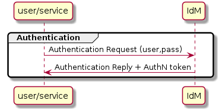

# IdM - Keyrock

## What's IdM - Keyrock (REVIEW)

Keyrock is the FIWARE component responsible for Identity Management. Using Keyrock (in conjunction with other security components such as PEP Proxy and Authzforce) enables you to add OAuth2-based authentication and authorization security to your services and applications.

With IdM-Keyrock component the authentication step is covered in IotCrawler environment.

Further information can be found in the [IdM-Keyrock documentation](https://fiware-idm.readthedocs.io/en/latest/index.html).

## IotCrawler integration/functionality

Inside this environment, IdM-Keyrock provides a REST API for receiving authentication queries. When an authentication request is received, the component recovers the credentials from the JSON body request and returns an IdM token if it's the case.

## API

Resources can be managed through the API (e.g. Users, applications and organizations). One of the main uses of IdM-Keyrock is to allow developers to add identity management (authentication and authorization) to their applications based on FIWARE identity. This is possible thanks to OAuth2 protocol. 

The specific IdM-Keyrock requests required in IotCrawler environment are defined in the next [REST API](idm-keyrock-api.rst).

Further information can be found in the [Keyrock Apiary](https://keyrock.docs.apiary.io/#).

## How to deploy/test (REVIEW)

This component can be deployed following the [README.md](https://github.com/IoTCrawler/Keyrock) file.

Once IdM-Keyrock is running you can test it. You can find postman collection with two requests needed inside IotCrawler environment in https://github.com/IoTCrawler/iotcrawler-samples/tree/master/authorization-enabler, with the POST one you can obtain a IdM token. You only need to define:

- `IdM-IP`:`IdM-Port` : Endpoint of IdM-Keyrock.
- Review `name` and `password` of configured IdM user you want to obtain token.