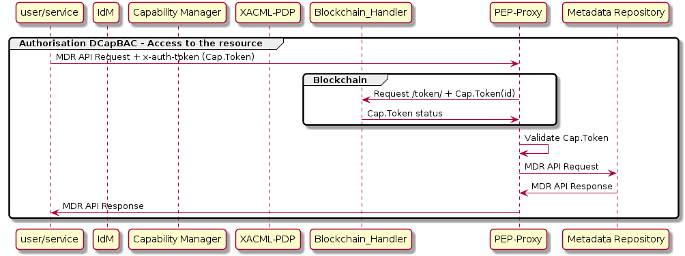

# PEP-Proxy

## What is a PEP-Proxy

PEP_Proxy is the component responsible for receiving the queries aimed to access to a resource, they are accompanied by the corresponding `Capability Token` and forwards requests to the corresponding endpoint (for example MetaData Repository) and the responses back to the requester.

PEP-Proxy is developed in Python and makes use of the functionality developed in Java (.jar file), and it's a DCapBAC component as we can show in the next image:

Remembering DCapBAC technology, where access control process is decoupled in two phases:

- 1st operation to receive authorisation. A token is issued
- 2nd operation access to the resource previously validating the token.

PEP-Proxy covers the second one.

## IotCrawler integration/functionality

As mentioned above, this component receives queries aimed to access to a resource, queries contain a `Capability Token`. The PEP-Proxy validates this token, and in case the evaluation is positive, it forwards requests to the specific endpoint's API.

When an access resource request is received by PEP-Proxy:

- recovers the `x-auth-token` header (`Capability Token`)-
- If Blockchain integration is configured in PEP-Proxy, that's the IoTCrawler case, PEP-Proxy access to Blockchain to obtain `Capability Token` status to validate if it was revoked.
- validate `Capability Token`.
- If `Capability Token` validation is successful, PEP-Proxy forwards the message and sends responses back to the requester.

## API

The PEP-Proxy component supports multiple [REST APIs](pep-proxy-api).

## How to deploy/test

This component can be deployed following the [README.md](https://github.com/IoTCrawler/PEP-Proxy) file.

To test PEP-Proxy the next components of IoTCrawler must be configured and launched.

- MetaData Repository (MDR).
- IdM-Keyrock.
- XACML-PDP.
- Capability Manager

Once PEP-Proxy is running you can test it. You can find postman collection with requests needed to obtain access tp a resource in https://github.com/IoTCrawler/iotcrawler-samples/tree/master/authorization-enabler. You only need to define:

- `IdM-IP`:`IdM-Port` : Endpoint of IdM-Keyrock.
- Review `name` and `password` of configured IdM user you want to obtain token.
- `CapMan-IP`:`CapMan-Port` : Endpoint of Capability Manager. Default port: 3030
- `action` : Example: "GET",
- `PEP-Proxy-IP`:`PEP-Proxy-Port` : Endpoint of PEP-Proxy. Default port: 1028
- `re`: Example: "/scorpio/v1/info/"