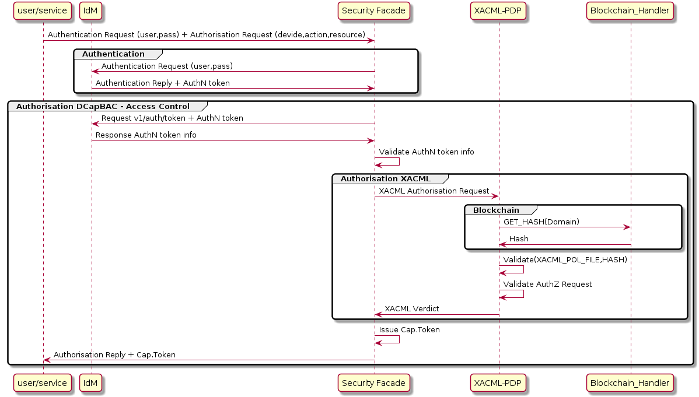

# Security Facade

## What's Security Facade

This component has been designed as an endpoint for performing both authentication and authorisation operations in a transparent way for the requester. It has been developed in Java.

In a traditional environment, we need to send three requests to have access to a resource:
- 1st operation to authenticate through user credentials (IdM-KeyRock)
- 2nd operation to receive authorisation. A token is issued (Capability Manager - DCapBAC technology component).
- 3rd operation access to the resource previously validating the token (PEP-Proxy - DCapBAC technology component).

Security Facade offers an API to do possible the fusion of the two first requests in only one.

## IotCrawler integration/functionality

As mentioned above, this component provides a REST API, when a request is received by Security Facade, it recovers from the JSON body:

- user credentials of IdM-Keyrock (access to IdM-Keyrock).
- an endpoint of the resource’s request (protocol+IP+PORT). In DCapBAC scenario, it corresponds with PEP-Proxy component.
- the action/method of the resource’s request (“POST”, “GET”, “PATCH”...)
- the path of the resource’s request

With this information, Security Facade interacts with Identity Manager and the Authorization Authorizer (XACML-PDP), and in case the requester has the appropriate permissions for the request, it sends the authorization token (Capacity Token) back to the requester.

## Capability token’s considerations:

The format of the capability token is based on JSON. Compared to more traditional formats such as XML, JSON is getting more attention from academia and industry in IoT scenarios, since it is able to provide a simple, lightweight, efficient, and expressive data representation, which is suitable to be used on constrained networks and devices. As shown below, this format follows a similar approach to JSON Web Tokens (JWTs), but including the access rights that are granted to a specific entity.
A brief description of each field is provided.

- Identifier (ID). This field is used to unequivocally identify a capability token. A random or pseudorandom technique will be employed by the issuer to ensure this identifier is unique.
- Issued-time (II). It identifies the time at which the token was issued as the number of seconds from 1970-01-01T0:0:0Z.
- Issuer (IS). The entity that issued the token and, therefore, the signer of it.
- Subject (SU). It makes reference to the subject to which the rights from the token are granted. A public key has been used to validate the legitimacy of the subject. Specifically, it is based on ECC, therefore, each half of the field represents a public key coordinate of the subject using Base64.
- Device (DE). It is a URI used to unequivocally identify the device to which the token applies.
- Signature (SI). It carries the digital signature of the token. As a signature in ECDSA is represented by two values, each half of the field represents one of these values using Base64.
- Access Rights (AR). This field represents the set of rights that the issuer has granted to the subject.
  - Action (AC). Its purpose is to identify a specific granted action. Its value could be any CoAP method (GET, POST, PUT, DELETE), although other actions could be also considered.
  - Resource (RE). It represents the resource in the device for which the action is granted.
  - Condition flag (F). It states how the set of conditions in the next field should be combined. A value of 0 means AND, and a value of 1 means OR.
  - Conditions (CO). Set of conditions which have to be fulfilled locally on the device to grant the corresponding action.
    - Condition Type (T). The type of condition to be verified.
    - Condition value (V). It represents the value of the condition.
    - Condition Unit (U). It indicates the unit of measure that the value represents.
- Not Before (NB). The time before which the token must not be accepted. Its value cannot be earlier than the II field and it implies the current time must be after or equal than NB..
- Not After (NA). It represents the time after which the token must not be accepted.

## API

The Security Facade component supports the next [REST API](security-facade-api).

## How to deploy/test

This component can be deployed following the [README.md](https://github.com/IoTCrawler/Security-Facade) file or for a

To test Capability Manager the next components of IoTCrawler must be configured and launched.

- Metadata Repository (MDR).
- IdM-Keyrock.
- XACML-PDP.

Once Security Facade is running you can test it. You can find postman collection with the request needed to obtain a capability token in https://github.com/IoTCrawler/iotcrawler-samples/tree/master/authorization-enabler. You only need to define:

- `Facade-IP`:`Facade-Port` : Endpoint of Security Facade. Default port: 8443
- Review `name` and `password` of configured IdM user you want to obtain capability token.
- `action` : Example: "GET",
- `PEP-Proxy-IP`:`PEP-Proxy-Port` : Endpoint of PEP-Proxy. Default port: 1028
- `resource`: path of the resource’s request. Example: "/scorpio/v1/info/"
