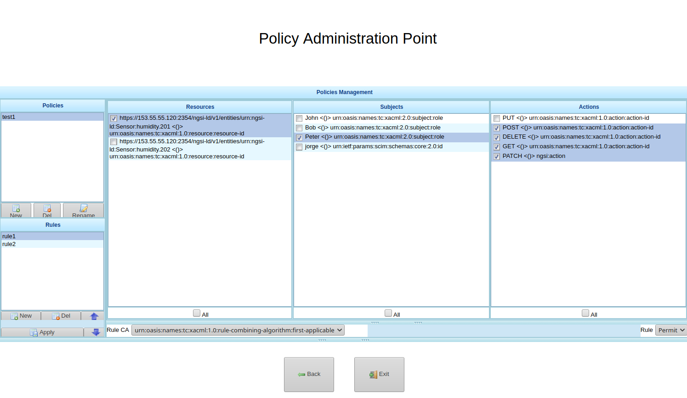

# XACML - PAP - PDP

## What's XACML - PAP - PDP

This element corresponds to the implementation of the XACML framework. It comprises:
- a Policy Administration Point (PAP) which is responsible for managing the authorisation policies
- a Policy Decision Point (PDP), responsible for issuing possitive/negativer verdicts whenever an authorisation request is received. 

The PAP presents a GUI for managing the XACML policies. They must be defined according to a triplet (subject, resource, action).

This project is developed in Java and it's a DCapBAC component as we can show in the next image:

Remembering DCapBAC technology, where access control process is decoupled in two phases:

- 1st operation to receive authorisation. A token is issued
- 2nd operation access to the resource previously validating the token.

XACML-PDP is the component which validates the authorization request inside the first phase.

## IotCrawler integration/functionality (REVIEW)

XACML-PAP, as mentioned above, it's a GUI for managing XACML policies (configuration), it's not interfering in the obtaining authorisation requests verdict. To define attributes and policies:

- Firstly, click “Manage Attributes” button to define the resources, actions and subjects. In subject’s case you need specify the Usernames you defined in KeyRock – Identity Manager. To save click “Save All Attributes” and “Back”.

- Finally, click “Manage Policies” button to define the policies. Here you can see all attributes defined previously. In this page you must define Policies and into them rules. Each rule can link resources, actions and subjects and establish if this combination is “Permit” or “Deny”.

XACML_PDP returns the verdict when an authorisation request is received from Capability Manager, it recovers from the body:

- the subject of the resource’s request.
- the resource: endpoint + path of the resource’s request.
- the action: method of the resource’s request ("POST", "GET", "PATCH"...)

With this information, XACML-PDP:

- Access to the XACML policies for validating authorisation requests and obtain if the subject can access to a resource and can perform the action over the resource (verdict). 
- In IoTCrawler project, PDP also access to Blockchain to obtain the hash of the domain and compare with the hash of XAML policies and if not equal verdict is negative.

## API

The XAML - PDP component supports the next [REST API](xacml-pdp-api.rst).

## How to deploy/test

This component can be deployed following the [README.md](https://github.com/IoTCrawler/PAP-PDP) file.

To test Policy Administration Point (PAP) and Policy Decision Point (PDP) the next components of IoTCrawler must be configured and launched.

- Blockchain.

Once XACML-PAP-PDP is running you can test it. You can find postman collection with a request sample to obtain a XACML verdict in https://github.com/IoTCrawler/iotcrawler-samples/tree/master/authorization-enabler. You only need to define:

- `XACML-PDP-IP`:`XACML-PDP-Port` : Endpoint of XACML-PDP. Default port: 8080
- Define `subject`, `resource` and `action` body parameters, where:

	- subject: subject of the resource’s request. In DCapBAC scenario, it could correspond with a username (IDM). For example: "Peter"
	- resource: endpoint + path of the resource’s request (protocol+IP+PORT+path). For example: "https://153.55.55.120:2354/ngsi-ld/v1/entities/urn:ngsi-ld:Sensor:humidity.201".  In DCapBAC scenario, endpoint corresponds with the PEP-Proxy one.
	- action: method of the resource’s request ("POST", "GET", "PATCH"...)