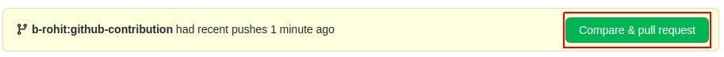
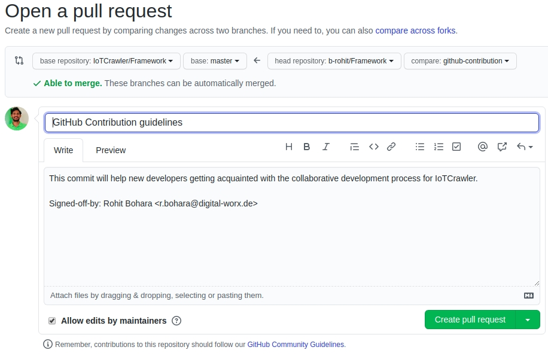

# GitHub Contribution Guidelines

## Create Github Account

All the repositories of IoTCrawler framework are hosted on GitHub. You need to create a GitHub account to start contributing for the IoTCrawler project. In oder to create the account go to [GitHub](https://github.com/) and and sign up with username, email and password.


## Fork Repository

IoTCrawler comprised of multiple components which are developed in respective repositories. When you start contributing it is recommended to fork the repository, make your changes and submit a pull request. It helps to keep the source code in master branch maintainable, clean and stable. The forking of a repository results in an identical copy of the repository in your personal account. With that, you will have full control over the repository to make changes in the source code. Once, you are satisfied with your changes you can submit a pull request to IoTCrawler official repository.

How to fork a repository?

- Open your browser and go to the IoTCrawler repository that you want to fork
- Click on fork button on top right corner

  

- Select your GitHub account and automatically the repository will be forked and will land you in cloned repository in your account

## Clone Repository

After the forking process, you have a repository in your account. The next step is to clone the repository to your local system. After cloning process, you will have source files in your local machine and could open in your favorite IDE for development.

How to clone a repository?

- Open your browser and go to the repository in your account that you want to clone
- Clink on Code button on middle right and copy the web URL
  
- Open your terminal and go to the directory where you want to clone
- Use `git clone <web-url>` e.g. `git clone https://github.com/b-rohit/Framework.git`
- Go to repository directory and add original IoTCrawler repository as remote upstream repository

  For an example Framework repository

  ```
  cd Framework
  git remote add upstream https://github.com/IoTCrawler/Framework.git
  ```

- You can check all your remote repositories with following command

  ```
  git remote -v
  ```

  For an example output of the command for Framework repository

  ```
  origin	https://github.com/b-rohit/Framework.git (fetch)
  origin	https://github.com/b-rohit/Framework.git (push)
  upstream	https://github.com/IoTCrawler/Framework.git (fetch)
  upstream	https://github.com/IoTCrawler/Framework.git (push)

  ```

Now, everything is set to start developing and making the IoTCrawler platform better.

## Create Feature Branch

All IoTCrawler component repositories have a main branch called `master`. The `master` branch contains the stable code of the component. The main idea behind using a feature branch for development is to keep the `master` branch unaffected from broken code in new feature. A developer should create a feature branch in its fork repository to develop new feature, to fix an issue, to purpose changes etc. A feature branch provides encapsulation from the main codebase. That means the `master` branch is isolated from errors caused by broken code of a new commit. It keeps the main codebase clean and stable.

How to create feature branch ?

- Fetch commits, files and refs from the upstream repository
  ```
  git fetch upstream
  ```
- Checkout to `master` branch
  ```
  git checkout master
  ```
- Merge upstream changes to local master branch
  ```
  git merge upstream/master
  ```
- Push changes to remote master in forked repo
  ```
  git push origin master
  ```
- Now, you have your origin/master and upstream/master synced. This process ensures there are no discrepancies between two branches and new feature branch is an exact copy of them.
  ```
  git checkout -b <feature_branch_name>
  ```

With this, you have a new feature branch, where you can make changes.

## Push changes to your Forked Repository

When you are done creating a new feature or fixing an issue in your feature branch, it is time to commit and push your changes to forked repository. This process will save the state in remote branch in forked repository. Later, this state will be used to create pull request to IoTCrawler component repository.

How to push ?

- Add your modified, delete and new files to the index
  ```
  git add <file1> <file2>
  ```
- You can now commit the current contents of the index. This will capture a snapshot of the project's currently staged changes. Your commit message must contain the following information:
  - one line summary of the changes in this commit as title, followed by an empty line
  - explain why this change is needed, and how you approached it in the commit message body. This helps reviewers better understand your code and often speeds up the review process.
  ```
  git commit -s
  ```
- Push changed to your forked repository
  ```
  git push origin <feature_branch_name>
  ```

At the end of this process you have developed a new feature or fixed an issue and pushed it to your forked repository. At this moment, your changes in the forked repository are ready to be integrated with IoTCrawler component repository. This can be done by making a pull request to IoTCrawler repository.

## Opening a Pull Request in GitHub

Once you have pushed your changes to the feature branch in your forked repo, you can now open a pull request against the original IoTCrawler component repository. This is going to be easiest of all tasks you have completed previously in this thread.

How to open Pull request ?

- Navigate to your forked repository `https://github.com/<user-name>/<forked_repository>`.
- For new changes, automatically it will be shown that there are some differences between forked and original repository. Click on `Compare & pull request`.
  
- You will be navigated to original IoTCrawler repository. Here, you can change title and comment message if you want and click on `Create pull request`.
  

Excelente, you just open your first pull request in IoTCrawler project. The pull request will be reviewed and merged in the original IoTCrawler repository.

## Delete Feature Branch

When you are finished with your feature and your pull request is accepted and merged in the original IoTCrawler repository, it is time to clean your forked repository. You need to delete the feature branch from your local and remote forked repository.

How to delete local and remote feature branch ?

- Delete your local feature branch

  ```
  git branch -d <feature_branch_name>
  ```

- Push your changes to delete remote branch

  ```
  git push --delete origin <feature_branch_name>
  ```

## Sync Your Forked Repository with Original

IoTCrawler is completely community based project. Therefore, the main codebase will keep getting commits from other developers. That means, you need to sync your forked repository with the original IoTCrawler repository. By doing so, you will avoid merge conflicts along the way.

How to sync?

- Fetch changes from upstream repository
  ```
  git fetch upstream
  ```
- Rebase the the local origin/master with upstream/master
  ```
  git rebase upstream/master
  ```
- Push the changes to the forked repository
  ```
  git push origin master
  ```
