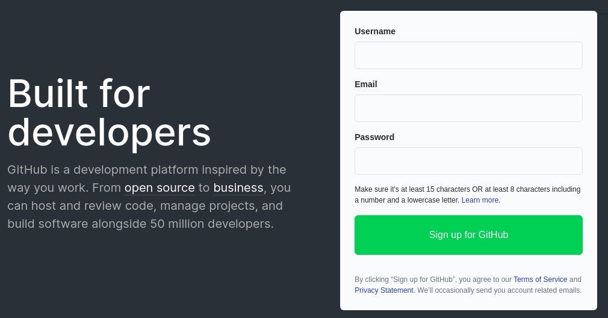

# GitHub Contribution Guidelines

## Create Github Account

All the repositories of IoTCrawler framework are hosted on GitHub. You need to create a GitHub account to start contributing for the IoTCrawler project. In oder to create the account go to [GitHub](https://github.com/) and and sign up with username, email and password.


## Fork Repository

IoTCrawler comprised of multiple components which are developed in respective repositories. When you start contributing it is recommended to fork the repository, make your changes and submit a pull request. It helps to keep the source code in master branch maintainable, clean and stable. The forking of a repository results in an identical copy of the repository in your personal account. With that, you will have full control over the repository to make changes in the source code. Once, you are satisfied with your changes you can submit a pull request to IoTCrawler official repository.

How to fork a repository?

- Open your browser and go to the IoTCrawler repository that you want to fork
- Click on fork button on top right corner

  

- Select your GitHub account and automatically the repository will be forked and will land you in cloned repository in your account

## Clone Repository

After the forking process, you have a repository in your account. The next step is to clone the repository to your local system. After cloning process, you will have source files in your local machine and could open in your favorite IDE for development.

How to clone a repository?

- Open your browser and go to the repository in your account that you want to clone
- Clink on Code button on middle right and copy the web URL
  
- Open your terminal and go to the directory where you want to clone
- Use `git clone <web-url>` e.g. `git clone https://github.com/b-rohit/Framework.git`
- Go to repository directory and add original IoTCrawler repository as remote upstream repository

  For an example Framework repository

  ```
  cd Framework
  git remote add upstream https://github.com/IoTCrawler/Framework.git
  ```

- You can check all your remote repositories with following command

  ```
  git remote -v
  ```

  For an example output of the command for Framework repository

  ```
  origin	https://github.com/b-rohit/Framework.git (fetch)
  origin	https://github.com/b-rohit/Framework.git (push)
  upstream	https://github.com/IoTCrawler/Framework.git (fetch)
  upstream	https://github.com/IoTCrawler/Framework.git (push)

  ```

Now, everything is set to start developing and making the IoTCrawler platform better.
