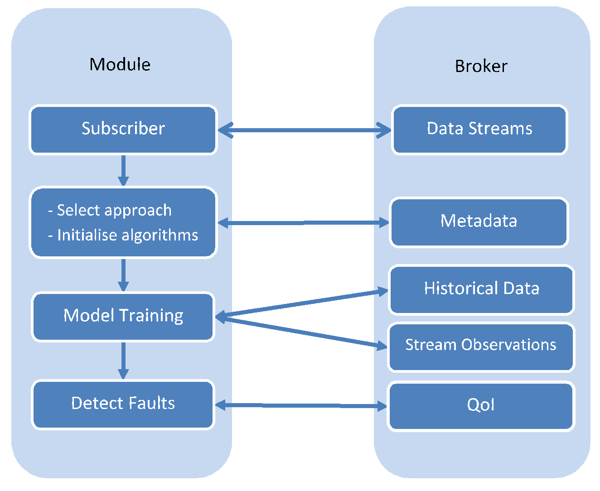

Fault Detection
===============

The Fault Detection components monitors every data stream that is available to the IoTCrawler framework. In the first layer, the component categorises faults as definite faults (faults that occur due to hardware issues) or as anomalies, which could occur because of a brief environmental factor, an unexpected behaviour detected through learned patterns and contextual information. These anomalies can be categorised as faults, if they persist for a longer period of time.

As the detection of faults requires different approaches in different scenarios, not every data stream can have the best detector suited to its needs. To cater to the needs of most of the sensor streams, the fault detection component uses two approaches, ARIMA based fault detection with time series analysis and a Dirichlet Process Gaussian State Model, which determines the likelihood for a value to occur based on the previous observations of the sensor.

Workflow
--------

The Fault Detection component subscribes to any new data stream that becomes available through the MDR. Through the metadata, the Fault Detection will determine which approach should be used. This is differentiated based on how much information is provided in metadata. For example, if seasonality/periodicity of a data stream is defined and the historical data is available for the desired duration, then ARIMA can be applied.

For the actual detection, the component will make use of the trained models and the corresponding QoI values for each data stream, calculated for each stream by the Semantic Enrichment. It will then notify the MDR in case of faults.

Stop a Fault Detection Instance
-------------------------------

The Fault Detection is an autonomous component and does not require human supervision. However, because it can not be used in every scenario, e.g. if it detects a lot of false positives, it can be manually stopped for an individual data stream. Stopping the Fault Detection is not performed autonomously in any case as the ground truth is not known in most scenario and hence, an accurate decision cannot be made. This method allows a manual intervention, e.g. by an administrator of an IoTCrawler instance.

.. http:get:: /api/stopFaultDetection

with payload

::

  {
    "sensorID" : <The ID of the sensor to stop>
  }

Restart a Fault Detection Instance
----------------------------------

A need to restart a Fault Detection instance may arise when the information related to the stream is changed. This change in information may happen due to the change of sensor device, correction of human error or some added insights about the data from the provider. This will require the Fault Detection instance to be restarted to re-evaluate the best available approach, reset the learning parameters and to train on relevant historical data.

.. http:get:: /api/restartFaultDetection

with payload

::

  {
    "sensorID" : <The ID of the sensor to restart>
  }
