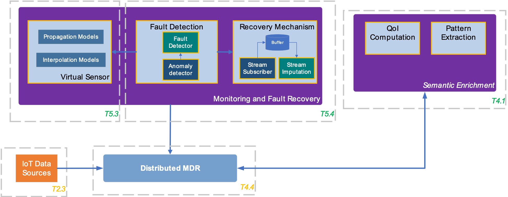

Monitoring
==========

The main task of the Monitoring component in IoTCrawler is to monitor the connected data streams in order to detect faulty/anomalous data samples.

The subcomponent **Fault Detection** is responsible to detect 'unusual behaviour' in the data streams and determine if a fault is present. In this case, counter measures are triggered, including recovery mechanisms to provide a quick response by imputing single *StreamObservations* or deploying a Virtual Sensor. To detect faults in a single data stream the **Fault Detecttion** uses a modified Dirichlet Process Gaussian State Machine Model and a ARIMA-based approach. The **Fault Recovery** utilises Markov Chain Monte Carlo (MCMC) methods to generate sensor samples.

In case a faulty data stream is detected, the subcomponent **Virtual Sensor Creator** is able to deploy a Virtual Sensor as a counter measure. It uses machine learning techniques to create sensor samples in relation to correlating, neighbouring sensors.

The following figure shows an overview of the **Monitoring** component and the interactions with other IoTCrawler components. For more details see the respective subsections.

The documentation for the **Monitoring's** subcomponents can be found here:

.. toctree::
   :maxdepth: 1

   fault_detection
   fault_recovery
   vs_creator
