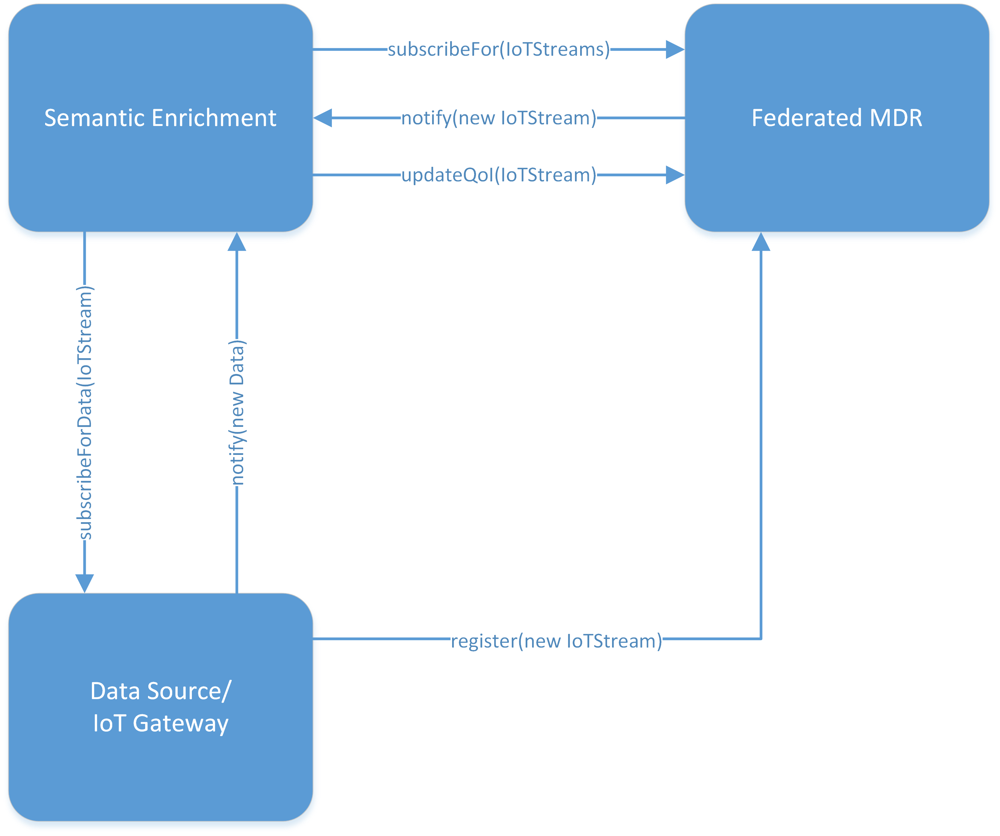
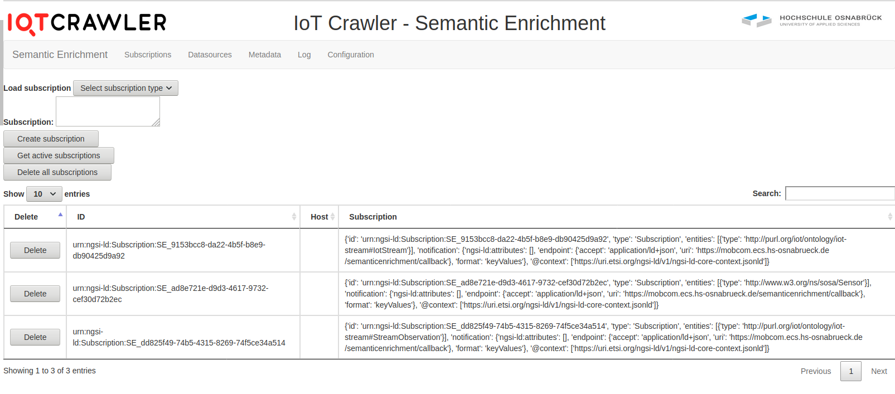
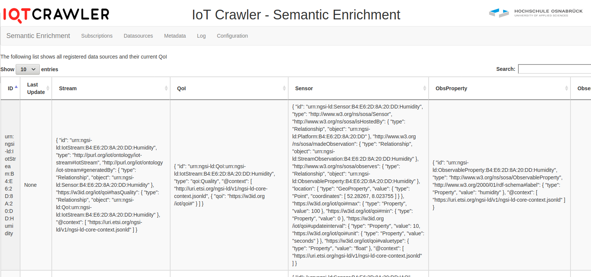
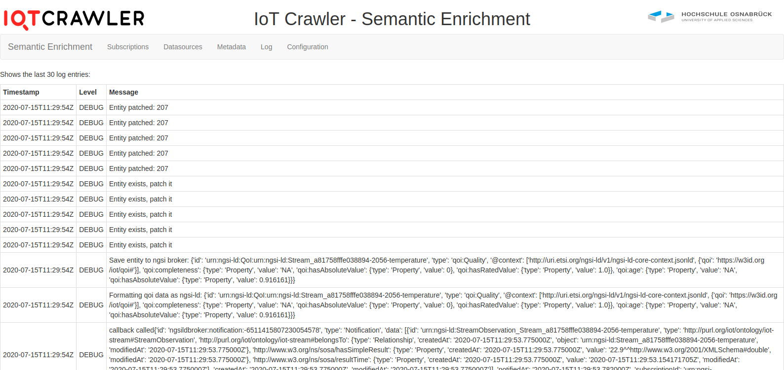
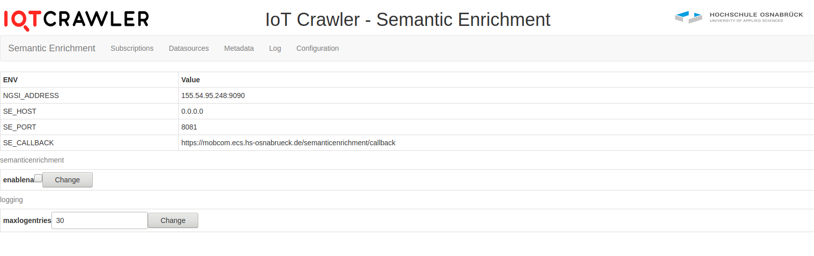

Quality Analyser
================
The Semantic Enrichment is one of the core components of the IoTCrawler framework. Besides the Pattern Extractor component described in a separate section, it also contains the Quality Analyser, which is responsible for the Quality of Information (QoI) computation. This QoI will further enrich the data provided by a stream so that other components, e.g. the ranking, make use of if.

Integration into IoTCrawler Framework
-------------------------------------
The IoTCrawler framework itself is loosely coupled by a set of single components to be on the one hand side as adoptable as possible, by keeping the flexibility to optimise single components without the need to adapt the complete framework, and on the other hand to ensure scalability.
The integration mainly focuses on publish/subscribe mechanisms that are used to communicate with the Federated MDR as the central register for all data sources and to access receive data from IoT gateways in different domains. As the example data sources used within the IoTCrawler project focus on NGSI-LD, the NGSI-LD publish/subscribe methods are used, but in principle the data access can also be realised by other access methods like MQTT or AMQP protocols. In these cases, the interfaces must be described in the data source’s metadata.

The figure above provides a detailed view of the interactions with the “neighbouring” components within the IoTCrawler framework. The interaction is divided into the following steps:

1. In a first step, the Semantic Enrichment sends a subscription message to the Federated MDR to subscribe to all updates in IoTStreams, where an IoTStream is a class type defined in the IoTCrawler information model. This allows the Semantic Enrichment to receive notifications for newly added or updated data streams.
2. In a next step a new data source is registered as an IoTStream at the Federated MDR. The registration contains details on how to access the related data source and additional metadata, e.g. a detailed description of the data sources properties and its characteristics.
3. For each newly registered or updated data source the Semantic Enrichment receives a notification. This allows to adopt the QoI calculation to changes in the metadata or to connect to a new data endpoint description to access data.
4. The Semantic Enrichment component subscribes to the data source based on the information delivered in the notification received from the Federated MDR.
5. In the last step the Semantic Enrichment calculates the QoI for each known data source and stores it to the metadata information within the Federated MDR. This allows other IoTCrawler components, as well as third-party users to access the additional information.

QoI calculation
---------------
In this section we will show how the provided input and output for the quality analysis have to look like. This is strongly related to the IoTCrawler information model.
The QoI Analyser relies on provided metadata for the QoI calculation. This is annotated in the description of the sensor that provides a data stream. An example sensor providing several metadata is shown below.

::

    {
        "id": "urn:ngsi-ld:Sensor:B4:E6:2D:8A:20:DD:Temperature",
        "type": "sosa:Sensor",
        "location": {
            "type": "GeoProperty",
            "value": {
            "type": "Point",
            "coordinates": [
                52.28267,
                8.023755
            ]
            }
        },
        "sosa:isHostedBy": {
            "type": "Relationship",
            "object": "urn:ngsi-ld:Platform:B4:E6:2D:8A:20:DD"
        },
        "sosa:observes": {
            "type": "Relationship",
            "object": "urn:ngsi-ld:ObservableProperty:B4:E6:2D:8A:20:DD:Temperature"
        },
        "sosa:madeObservation": {
            "type": "Relationship",
            "object": "urn:ngsi-ld:StreamObservation:B4:E6:2D:8A:20:DD:Temperature"
        },
        "qoi:updateinterval": {
            "type": "Property",
            "value": 10,
            "qoi:unit": {
            "type": "Property",
            "value": "seconds"
            }
        },
        "qoi:valuetype": {
            "type": "Property",
            "value": "float"
        },
        "qoi:min": {
            "type": "Property",
            "value": -20
        },
        "qoi:max": {
            "type": "Property",
            "value": 50
        },
        "@context": [
            "http://uri.etsi.org/ngsi-ld/v1/ngsi-ld-core-context.jsonld",
            {
            "sosa": "http://www.w3.org/ns/sosa/",
            "qoi": "https://w3id.org/iot/qoi#"
            }
        ]
    }

This sensor is related to the following data stream:

::

    {
        "id": "urn:ngsi-ld:IotStream:B4:E6:2D:8A:20:DD:Temperature",
        "type": "iot-stream:IotStream",
        "iot-stream:generatedBy": {
            "type": "Relationship",
            "object": "urn:ngsi-ld:Sensor:B4:E6:2D:8A:20:DD:Temperature"
        },
        "qoi:hasQuality": {
            "type": "Relationship",
            "object": "urn:ngsi-ld:QoI:urn:ngsi-ld:IotStream:B4:E6:2D:8A:20:DD:Temperature"
        },
        "@context": [
            "http://uri.etsi.org/ngsi-ld/v1/ngsi-ld-core-context.jsonld",
            {
            "iot-stream": "http://purl.org/iot/ontology/iot-stream#",
            "qoi": "https://w3id.org/iot/qoi#"
            }
        ]
    }

During quality calculation the relationship "qoi:hasQuality" will be set to a new QoI entity similar to the following one:

::

    {
        "id":"urn:ngsi-ld:QoI:urn:ngsi-ld:IotStream:B4:E6:2D:8A:20:DD:Temperature",
        "type":"qoi:Quality",
        "@context":[
            "http://uri.etsi.org/ngsi-ld/v1/ngsi-ld-core-context.jsonld",
            {
                "qoi":"https://w3id.org/iot/qoi#"
            
        }
        
        ],
        "qoi:plausibility":{
            "type":"Property",
            "value":"NA",
            "qoi:hasAbsoluteValue":{
                "type":"Property",
                "value":1
            
        },
            "qoi:hasRatedValue":{
                "type":"Property",
                "value":1.0
            
        }
        
        },
        "qoi:completeness":{
            "type":"Property",
            "value":"NA",
            "qoi:hasAbsoluteValue":{
                "type":"Property",
                "value":1
            
        },
            "qoi:hasRatedValue":{
                "type":"Property",
                "value":0.6000000000000001
            
        }
        
        },
        "qoi:age":{
            "type":"Property",
            "value":"NA",
            "qoi:hasAbsoluteValue":{
                "type":"Property",
                "value":10462442.743888
            
        }
        
        },
        "qoi:frequency":{
            "type":"Property",
            "value":"NA",
            "qoi:hasAbsoluteValue":{
                "type":"Property",
                "value":11.000385
            
        },
            "qoi:hasRatedValue":{
                "type":"Property",
                "value":0.6000000000000001
            
        }
        
        }
    }

Sourcecode
----------
The sourcecode for the component is available at https://github.com/IoTCrawler/SemanticEnrichment

Installation
------------
The Quality Analyser is provided with a docker file. Within this dockerfile there are several environment variables that have to be provided:

* NGSI_ADDRESS http://mdr.iotcrawler.eu/
* SE_HOST 0.0.0.0
* SE_PORT 8081
* SE_CALLBACK https://semantic-enrichment.iotcrawler.eu/semanticenrichment/callback

The NGSI_ADDRESS is the address of the MDR where information about all available sensors and streams are stored. This address is needed to subscribe for incoming or changing metadata.
The SE_HOST is the address/interface where the Quality Analyser component should bind to. SE_PORT defines the port where the component is accessible.
Finally SE_CALLBACK is the callback address of the component. This address is used for the subscriptions send to the MDR and will receive all notifications.

For installation the provided docker-compose script can be used to build and start the component:

* build: docker-compose build
* start: docker-compose up -d

This will start a docker container called "semanticenrichment".

UI
--
The UI provides some useful information about running subscriptions, known data sources, and the current configuration.

The subscription UI above shows running subscriptions and provides a form to create new subscriptions.

The UI above lists the known data sources in its IoTCrawler information model format.

The log provides information about incoming data, internal exceptions etc.

The configuration UI allows to check the set environment variables and to set the log size provided in the UI.