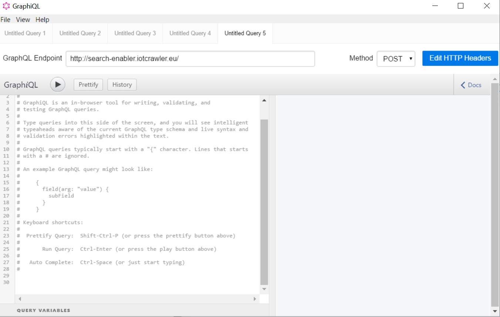

GraphQL Tutorial
==================

.. contents:: Table of contents
   :local:
   :backlinks: none
   :depth: 3

Introduction
------------------------
GraphQL-based search enabler provides a flexible capabilities for searching metadata about Streams, Sensors and Observable Properties registered in IoTCrawler Metadata Repository (MDR).

In this tutorial we demonstrating a use-case of finding streams delivering a certain type of measurements.

All the demonstrated queries can be executed in the online `GraphiQL Environment <http://search-enabler.iotcrawler.eu/>`_ using the supplied links. 

GraphiQL
------------------------

The GraphiQL is a simple IDE for constructing and testing queries against a GraphQL endpoint. GraphiQL might be provided by endpoint provider (like it is `provided by IoTCrawler <http://search-enabler-production.35.241.228.250.nip.io>`_ ) or user might run it `locally using the desktop client <https://www.electronjs.org/apps/graphiql>`_.

GraphiQL provides interactive user assistance functions such as query validation, auto completion (Ctrl+Space), undo/redo, formatting, history and many others.

Then the queries are ready they can be integrated into your application and submitted directly to the GraphQL endpoint without using GraphiQL.

User assistance in GraphiQL is based on a GraphQL schema of a target endpoint. The schema describes the structure of a query language of target endpoint (data types, interfaces, queries, mutations). 

To introspect the GraphQL schema of a particular endpoint execute the following query:
::

  {
    __schema {
      types {
        name
        fields {
          name
          type {
            name
          }
        }
      }
    }
  }

`Run online <http://search-enabler.iotcrawler.eu/?query=%20%20%7B%0A%20%20%20%20__schema%7B%0A%20%20%20%20types%7B%0A%20%20%20%20%20%20name%0A%20%20%20%20%20%20fields%7B%0A%20%20%20%20%20%20%20%20name%0A%20%20%20%20%20%20%20%20type%20%7Bname%7D%0A%20%20%20%20%20%20%7D%0A%20%20%20%20%7D%0A%20%20%20%20%7D%0A%20%20%7D>`__

IoTCrawler schema
------------------------

The search enabler component has an extendable schemas mechanism described in further sections. 

The `IoTCrawler's Core Schema <https://github.com/IoTCrawler/Search-Enabler/blob/master/src/resources/schemas/iotcrawler.graphqls>`_ defines core types (such as IoTStream, Sensor, Platform, Observable Property). 

Due to support of type inheritance (feature of IoTCrawler's `GraphQL-based Search Enabler <https://github.com/IoTCrawler/Search-Enabler>`_), the schema is compliant with `SOSA ontology <https://www.w3.org/TR/vocab-ssn/>`_.

For example, according to SOSA a platform (`SOSA:Platform`) hosts systems (`SSN:System`), which includes sensors (`SOSA:Sensor`), actuators (`SOSA:Actuator`) and samples (`SOSA:Sample`). 

Browsing platforms
------------------------
For demonstrating inheritance support lets browse over the platforms and objects they host. This can be done by performing the following query:

::

  {
    platforms(offset: 0, limit: 5) {
      id
      hosts {
        id
        type
      }
    }
  }

`Run online <https://search-enabler.iotcrawler.eu/?query=%7B%0A%20%20platforms%20(offset%3A0%2C%20limit%3A5)%7B%0A%20%20%20%20id%2C%0A%20%20%20%20hosts%7B%0A%20%20%20%20%20%20id%2C%0A%20%20%20%20%20%20type%0A%20%20%20%20%7D%0A%20%20%7D%0A%7D>`__

The result will look as below. 
::

 "platforms": [
    {
      "id": "urn:ngsi-ld:Platform:B4:E6:2D:8A:20:DD",
      "hosts": [
        {
          "id": "urn:ngsi-ld:Sensor:B4:E6:2D:8A:20:DD:IAQ",
          "type": "http://www.w3.org/ns/sosa/Sensor"
        },
        {
          "id": "urn:ngsi-ld:Sensor:B4:E6:2D:8A:20:DD:Temperature",
          "type": "http://www.w3.org/ns/sosa/Sensor"
        },
        {
          "id": "urn:ngsi-ld:Sensor:B4:E6:2D:8A:20:DD:Humidity",
          "type": "http://www.w3.org/ns/sosa/Sensor"
        }
      ]
    }
  ]

As you can see, resulting platforms host sensors, while `schema <https://github.com/IoTCrawler/Search-Enabler/blob/master/src/resources/schemas/iotcrawler.graphqls>`_ declares, that `Platform` hosts `System`. This is possible due to type inheritance feature described above.

Browsing observable properties 
------------------------------
Let's return back to our use-case, where we want to find streams matching the criteria and get their measurements. 

Before searching streams by a certain observable property let's have a quick look at observable properties registered in the IoTCrawler platform. Let can query all the observable properties as paginated list by using the `limit` and `offset` variables. The default limit is 500 (maximal of broker). 

::

  {
    observableProperties(offset: 0, limit: 5) {
      id
      label
    }
  }

`Run online <http://search-enabler.iotcrawler.eu/?query=%20%20%7B%0A%20%20%20%20observableProperties(offset%3A0%2C%20limit%3A5)%7B%0A%20%20%20%20%20%20id%2C%0A%20%20%20%20%20%20label%2C%0A%20%20%20%20%7D%0A%20%20%7D>`__

Response should look like below, where we see identifiers and labels of observable properties registered in the IoTCrawler metadata repository.

::

  {
    "data": {
      "observableProperties": [
        {
          "id": "urn:ngsi-ld:ObservableProperty:B4:E6:2D:8A:20:DD:Temperature",
          "label": "temperature"
        },
        {
          "id": "urn:ngsi-ld:ObservableProperty:B4:E6:2D:8A:20:DD:Humidity",
          "label": "humidity"
        },
        {
          "id": "urn:ngsi-ld:ObservableProperty:B4:E6:2D:8A:20:DD:IAQ",
          "label": "iaq"
        },
        {
          "id": "urn:ngsi-ld:ObservableProperty:SolarPowerAarhus:currentProduction",
          "label": "currentproduction"
        },
        {
          "id": "urn:ngsi-ld:ObservableProperty:AvailableParkingSpaces",
          "label": "available parking spaces"
        }
      ]
    }
    ...
  }

Searching sensors
-----------------
Imagine that before dealing with the stream, we are interested in details about its sensor and the platform, which provide that data into IoTCrawler. 
In order to do so perform the following query:

::

  {
    sensors(observes: {label: "temperature"}) {
      id
      label
      isHostedBy {
        id
      }
    }
  }

`Run online <http://search-enabler.iotcrawler.eu/?query=%7B%20%0A%20%20%20%20%20%20sensors(observes%3A%20%7B%0A%20%20%20%20%20%20%20%20%20%20%20%20%20%20%20%20%20%20%20%20%20%20%20%20%20%20label%3A%20%22temperature%22%0A%20%20%20%20%20%20%20%20%20%20%20%20%20%20%20%20%20%20%20%20%20%20%20%20%7D%0A%20%20%20%20%20%20%20%20%20%20%20%20)%7B%0A%20%20%20%20%20%20%20%20%20%20%20%20%20%20%20%20%20%20%20%20%20%20id%2C%0A%20%20%20%20%20%20%20%20%20%20%20%20%20%20%20%20%20%20%20%20%20%20label%2C%0A%20%20%20%20%20%20%20%20%20%20%20%20%20%20%20%20%20%20%20%20%20%20isHostedBy%7B%20%20%23Platform%0A%20%20%20%20%20%20%20%20%20%20%20%20%20%20%20%20%20%20%20%20%20%20%20%20id%2C%0A%20%20%20%20%20%20%20%20%20%20%20%20%20%20%20%20%20%20%20%20%20%20%7D%0A%20%20%20%20%20%20%20%20%20%20%20%20%20%20%20%20%20%20%20%20%20%20%0A%20%20%20%20%20%20%20%20%20%20%20%20%20%20%20%20%20%20%7D%0A%20%20%20%20%7D>`__

Response should look like below:

::

  {
    "data": {
      "sensors": [
        {
          "id": "urn:ngsi-ld:Sensor:B4:E6:2D:8A:20:DD:Temperature",
          "label": null,
          "isHostedBy": {
            "id": "urn:ngsi-ld:Platform:B4:E6:2D:8A:20:DD",
            "label": null
          }
        }
      ]
    },
    ..
  }

Searching streams
------------------------

Finally we need to get streams, which are matching our criteria. For doing this we can filter streams by sensor id (which we've found on a previous step) or by specifying our condition (observes temperature) directly for a filter in the streams query:

::

  query streams {
    streams(generatedBy: {observes: {label: "temperature"}}) {
      id
      generatedBy {
        id
        label
        isHostedBy {
          id
          label
        }
      }
    }
  }

`Run online <http://search-enabler.iotcrawler.eu/?operationName=streams&query=query%20streams%7B%20%20%0A%20%20%20%20streams(generatedBy%3A%20%7B%0A%20%20%20%20%20%20%20%20%20%20%20%20%20%20%20%20%20%20%20%20%20%20%20%20observes%3A%20%7B%0A%20%20%20%20%20%20%20%20%20%20%20%20%20%20%20%20%20%20%20%20%20%20%20%20%20%20%09%20%20label%3A%20%22temperature%22%0A%20%20%20%20%20%20%20%20%20%20%20%20%20%20%20%20%20%20%20%20%20%20%20%20%7D%0A%20%20%20%20%20%20%20%20%20%20%20%20%20%20%20%20%7D%0A%20%20%20%20%20%20%20%20%20%20%20%20%20%20%20%20)%0A%20%20%20%20%20%20%20%20%20%20%20%20%20%20%20%20%7B%0A%20%20%20%20%20%20%20%20%20%20%20%20%20%20%20%20%20%20%20%20id%2C%0A%20%20%20%20%20%20%20%20%20%20%20%20%20%20%20%20%20%20%20%20generatedBy%20%7B%20%23sensor%0A%20%20%20%20%20%20%20%20%20%20%20%20%20%20%20%20%20%20%20%20%20%20%20%20id%2C%0A%20%20%20%20%20%20%20%20%20%20%20%20%20%20%20%20%20%20%20%20%20%20%20%20label%2C%0A%20%20%20%20%20%20%20%20%20%20%20%20%20%20%20%20%20%20%20%20%20%20%20%20isHostedBy%7B%20%20%23platform%0A%20%20%20%20%20%20%20%20%20%20%20%20%20%20%20%20%20%20%20%20%20%20%20%20%20%20%20%20%20%20%20%20%20%20%20%20%20%20id%2C%0A%20%20%20%20%20%20%20%20%20%20%20%20%20%20%20%20%20%20%20%20%20%20%20%20%20%20%20%20%20%20%20%20%20%20%20%20%20%20label%2C%0A%20%20%20%20%20%20%20%20%20%20%20%20%20%20%20%20%20%20%20%20%20%20%20%20%20%20%20%20%20%20%20%20%20%20%20%20%20%20%7D%0A%20%20%20%20%20%20%20%20%20%20%20%20%20%20%20%20%20%20%20%20%7D%0A%20%20%20%20%20%20%20%20%20%20%20%20%20%20%20%20%7D%0A%20%20%7D>`__

The results would reflect the details about streams (`id`), their sensors (under `id` and `label` in the `generatedBy` block) and platforms (`id` and `label` in the `isHostedBy` block). 

::

  {
    "data": {
      "streams": [
        {
          "id": "urn:ngsi-ld:IotStream:B4:E6:2D:8A:20:DD:Temperature",
          "generatedBy": {
            "id": "urn:ngsi-ld:Sensor:B4:E6:2D:8A:20:DD:Temperature",
            "label": null,
            "isHostedBy": {
              "id": "urn:ngsi-ld:Platform:B4:E6:2D:8A:20:DD",
              "label": null
            }
          }
        }
      ]
    }
    ..
  }

The example demonstrates that it is possible to filter the target object together with all the relevant information (stream, sensor, platform, observable property) in one GraphQL query. 

Searching stream observations
-----------------------------

Stream observations are not considered as metadata and not expected to be stored in IoTCrawler's metadata repository, but expected to be delivered by broker's federation mechanism.

Subscription is the most expected way of receiving stream observations. But there is still an opportunity to request the actual state of a certain stream observation.

Perform the following query to return stream observations of streams, we have been interested in previous examples:

::

  {
    streamObservations(belongsTo: {generatedBy: {observes: {label: "temperature"}}}) {
      id
      resultTime
      hasSimpleResult
      belongsTo {
        id
        generatedBy {
          id
          observes {
            id
            label
          }
        }
      }
    }
  }

`Run online <http://search-enabler.iotcrawler.eu/?query=%7B%0A%20%20%20%20streamObservations(belongsTo%3A%20%7B%0A%20%20%20%20%20%20generatedBy%3A%20%7B%0A%20%20%20%20%20%20%20%20%20%20%20%20%20%20%20%20%20%20%20%20%20%20%20%20%0A%20%20%20%20%20%20%20%20%20%20%20%20%20%20%20%20%20%20%20%20%20%20%20%20observes%3A%20%7B%0A%20%20%20%20%20%20%20%20%20%20%20%20%20%20%20%20%20%20%20%20%20%20%20%20%0A%20%20%20%20%20%20%20%20%20%20%20%20%20%20%20%20%20%20%20%20%20%20%20%20%20%20%20%20%20%20label%3A%20%22temperature%22%0A%20%20%20%20%20%20%20%20%20%20%20%20%20%20%20%20%20%20%20%20%20%20%20%20%7D%0A%20%20%20%20%20%20%20%20%20%20%20%20%20%20%20%20%7D%0A%20%20%20%20%7D)%7B%0A%20%20%20%20%20%20id%2C%0A%20%20%20%20%20%20resultTime%2C%0A%20%20%20%20%20%20hasSimpleResult%2C%0A%20%20%20%20%20%20belongsTo%7B%0A%20%20%20%20%20%20%20%20id%2C%0A%20%20%20%20%20%20%20%20generatedBy%20%7B%0A%20%20%20%20%20%20%20%20%20%20id%2C%0A%20%20%20%20%20%20%20%20%20%20observes%7B%0A%20%20%20%20%20%20%20%20%20%20id%2C%0A%20%20%20%20%20%20%20%20%20%20label%0A%20%20%20%20%20%20%20%20%7D%0A%20%20%20%20%20%20%20%20%0A%20%20%20%20%20%20%7D%0A%20%20%20%20%20%20%7D%0A%20%20%20%20%7D%0A%20%20%7D>`__

The query is expected to return the following results:

::

  {
    "data": {
      "streamObservations": [
        {
          "id": "urn:ngsi-ld:StreamObservation:B4:E6:2D:8A:20:DD:Temperature",
          "resultTime": "2020-07-07T13:18:37Z",
          "hasSimpleResult": 29.09628,
          "belongsTo": {
            "id": "urn:ngsi-ld:IotStream:B4:E6:2D:8A:20:DD:Temperature",
            "generatedBy": {
              "id": "urn:ngsi-ld:Sensor:B4:E6:2D:8A:20:DD:Temperature",
              "observes": {
                "id": "urn:ngsi-ld:ObservableProperty:B4:E6:2D:8A:20:DD:Temperature",
                "label": "temperature"
              }
            }
          }
        }
      ]
    }
  }

Extendable schemas
------------------------

As was mentioned before, the search enabler supports extendable schemas and allows application owners to register/store custom data models in MDR and expose them via GraphQL queries.

Due to type inheritance it is possible to create custom (e.g. more specific) data types, which will be still be reachable via queries of core IoTCrawler types. 

Let's create a couple of specific sensor types: the `Temperature Sensor` and `Indoor Temperature Sensor`. For doing so we need to create a separate GraphQL schema with the following definitions:

::

  schema {
      query: Query

  }

  type Query {
      temperatureSensors(isHostedBy: PlatformInput, observes: ObservablePropertyInput, offset: Int = 0, limit: Int = 0): [TemperatureSensor]
      indoorTemperatureSensors(isHostedBy: PlatformInput, observes: ObservablePropertyInput, offset: Int = 0, limit: Int = 0): [IndoorTemperatureSensor]
  }

  type TemperatureSensor @resource(class : "http://purl.org/iot/ontology/extended-iot-stream#TemperatureSensor", subClassOf: ["Sensor"]){

  }

  type IndoorTemperatureSensor @resource(class : "http://purl.org/iot/ontology/extended-iot-stream#IndoorTemperatureSensor", subClassOf: ["TemperatureSensor"]){

  }

As you can see, the schema introduces two additional data types (but not extending them with additional fields). Due to two new queries new sensors can be queried in GraphiQL. 
The schema reuses types (e.g. Sensor, PlatformInput, etc.) from the other schemas (the core schema in this case).

Let's first query indoor temperature sensors as the most specific data type:

::

  {
    indoorTemperatureSensors {
      id
      type
      alternativeType
      label
      observes {
        id
        label
      }
      isHostedBy {
        id
        label
        hosts {
          id
          label
        }
      }
    }
  }

`Run online <https://search-enabler.iotcrawler.eu/?query=%7B%0A%20%20%20indoorTemperatureSensors%7B%0A%20%20%20%20%20%20%20%20%20%20%20id%2C%0A%20%20%20%20%20%20%20%20%20%20%20type%2C%0A%20%20%20%20%20%20%20%20%20%20%20alternativeType%2C%0A%20%20%20%20%20%20%20%20%20%20%20label%2C%0A%20%20%20%20%20%20%20%20%20%20%20observes%20%7B%0A%20%20%20%20%20%20%20%20%20%20%20%20%20%20%20id%2C%0A%20%20%20%20%20%20%20%20%20%20%20%20%20%20%20label%0A%20%20%20%20%20%20%20%20%20%20%20%7D%2C%0A%20%20%20%20%20%20%20%20%20%20%20isHostedBy%7B%0A%20%20%20%20%20%20%20%20%20%20%20%20%20%20%20%20%20%20%20%20%20%20%20id%2C%0A%20%20%20%20%20%20%20%20%20%20%20%20%20%20%20%20%20%20%20%20%20%20%20label%2C%0A%20%20%20%20%20%20%20%20%20%20%20%20%20%20%20%20%20%20%20%20%20%20%20hosts%7B%0A%20%20%20%20%20%20%20%20%20%20%20%20%20%20%20%20%20%20%20%20%20%20%20%20%20%20%20%20%20%20%20%20%20id%2C%0A%20%20%20%20%20%20%20%20%20%20%20%20%20%20%20%20%20%20%20%20%20%20%20%20%20%20%20%20%20%20%20%20%20label%0A%20%20%20%20%20%20%20%20%20%20%20%20%20%20%20%20%20%20%20%20%20%20%20%20%20%20%20%20%20%20%20%7D%0A%20%20%20%20%20%20%20%20%20%20%20%20%20%20%20%20%20%20%20%20%20%7D%0A%20%20%7D%0A%7D>`__

The result will reflect the temperature sensor we've registered with the `following code <https://github.com/IoTCrawler/Search-Enabler/blob/master/src/test/java/com/agtinternational/iotcrawler/graphqlEnabler/smartConnect/TestsSmartConnect.java>`_:

::

  {
    "data": {
      "indoorTemperatureSensors": [
        {
          "id": "urn:ngsi-ld:IndoorTemperatureSensor_1",
          "type": "http://www.w3.org/ns/sosa/Sensor",
          "alternativeType": "http://purl.org/iot/ontology/extended-iot-stream#TemperatureSensor",
          "label": null,
          "observes": null,
          "isHostedBy": {
            "id": "urn:ngsi-ld:Platform_homee_1",
            "label": "Platform homee_1",
            "hosts": [
              {
                "id": "urn:ngsi-ld:IndoorTemperatureSensor_1",
                "label": null
              },
              {
                "id": "urn:ngsi-ld:TemperatureSensor_1",
                "label": null
              }
            ]
          }
        }
      ]
    }
  }

You can see that entity still has type `http://www.w3.org/ns/sosa/Sensor` and the `http://purl.org/iot/ontology/extended-iot-stream#TemperatureSensor` is declared as `alternativeType`. This makes the indoor temperature sensors searchable while "sensors()" queries.

Now let's query temperature sensors, which should include indoor temperature sensors as well:

::

  {
    temperatureSensors {
      id
      type
      alternativeType
      label
      observes {
        id
        label
      }
      isHostedBy {
        id
        label
        hosts {
          id
          label
        }
      }
    }
  }

`Run online <https://search-enabler.iotcrawler.eu/?query=%7B%0A%20%20%20temperatureSensors%7B%0A%20%20%20%20%20%20%20%20%20%20%20id%2C%0A%20%20%20%20%20%20%20%20%20%20%20type%2C%0A%20%20%20%20%20%20%20%20%20%20%20alternativeType%2C%0A%20%20%20%20%20%20%20%20%20%20%20label%2C%0A%20%20%20%20%20%20%20%20%20%20%20observes%20%7B%0A%20%20%20%20%20%20%20%20%20%20%20%20%20%20%20id%2C%0A%20%20%20%20%20%20%20%20%20%20%20%20%20%20%20label%0A%20%20%20%20%20%20%20%20%20%20%20%7D%2C%0A%20%20%20%20%20%20%20%20%20%20%20isHostedBy%7B%0A%20%20%20%20%20%20%20%20%20%20%20%20%20%20%20%20%20%20%20%20%20%20%20id%2C%0A%20%20%20%20%20%20%20%20%20%20%20%20%20%20%20%20%20%20%20%20%20%20%20label%2C%0A%20%20%20%20%20%20%20%20%20%20%20%20%20%20%20%20%20%20%20%20%20%20%20hosts%7B%0A%20%20%20%20%20%20%20%20%20%20%20%20%20%20%20%20%20%20%20%20%20%20%20%20%20%20%20%20%20%20%20%20%20id%2C%0A%20%20%20%20%20%20%20%20%20%20%20%20%20%20%20%20%20%20%20%20%20%20%20%20%20%20%20%20%20%20%20%20%20label%0A%20%20%20%20%20%20%20%20%20%20%20%20%20%20%20%20%20%20%20%20%20%20%20%20%20%20%20%20%20%20%20%7D%0A%20%20%20%20%20%20%20%20%20%20%20%20%20%20%20%20%20%20%20%20%20%7D%0A%20%20%7D%0A%7D>`__

The result should return back at least two sensors: one of type `temperature sensor` and one of type `indoor temperature sensor`. 

::

  {
    "data": {
      "temperatureSensors": [
        {
          "id": "urn:ngsi-ld:TemperatureSensor_1",
          "type": "http://www.w3.org/ns/sosa/Sensor",
          "alternativeType": "http://purl.org/iot/ontology/extended-iot-stream#TemperatureSensor",
          "label": null,
          "observes": null,
          "isHostedBy": {
            "id": "urn:ngsi-ld:Platform_homee_1",
            "label": "Platform homee_1",
            "hosts": [
              {
                "id": "urn:ngsi-ld:IndoorTemperatureSensor_1",
                "label": null
              },
              {
                "id": "urn:ngsi-ld:TemperatureSensor_1",
                "label": null
              }
            ]
          }
        },
        {
          "id": "urn:ngsi-ld:IndoorTemperatureSensor_1",
          "type": "http://www.w3.org/ns/sosa/Sensor",
          "alternativeType": "http://purl.org/iot/ontology/extended-iot-stream#IndoorTemperatureSensor",
          "label": null,
          "observes": null,
          "isHostedBy": {
            "id": "urn:ngsi-ld:Platform_homee_1",
            "label": "Platform homee_1",
            "hosts": [
              {
                "id": "urn:ngsi-ld:IndoorTemperatureSensor_1",
                "label": null
              },
              {
                "id": "urn:ngsi-ld:TemperatureSensor_1",
                "label": null
              }
            ]
          }
        }
      ]
    }
  }

And again you can see, that both of them have type `sosa:Sensor` and their real types are declared as `alternativeType`. 

The alternative type is an optional filed and is interpreted by the search-enabler only. 

The actual list of schemas created to Search Enabler can be found in the `repository <https://github.com/IoTCrawler/Search-Enabler/tree/master/src/resources/schemas>`_. 
The list is extendable by new domain-specific schemas provided by application owners. 

References
------------------------

`Search Enabler Source (Github) <https://github.com/IoTCrawler/Search-Enabler>`_

`List of schemas <https://github.com/IoTCrawler/Search-Enabler/tree/master/src/resources/schemas>`_

`Detailed description of Search Enabler (Project Deliverable) <https://iotcrawler.eu/wp-content/uploads/2020/07/D5.2_Final.pdf>`_
